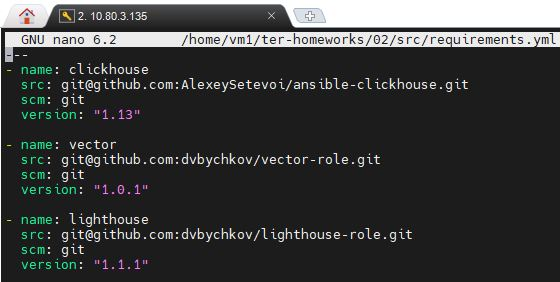
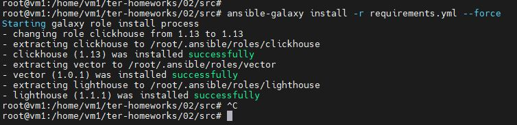
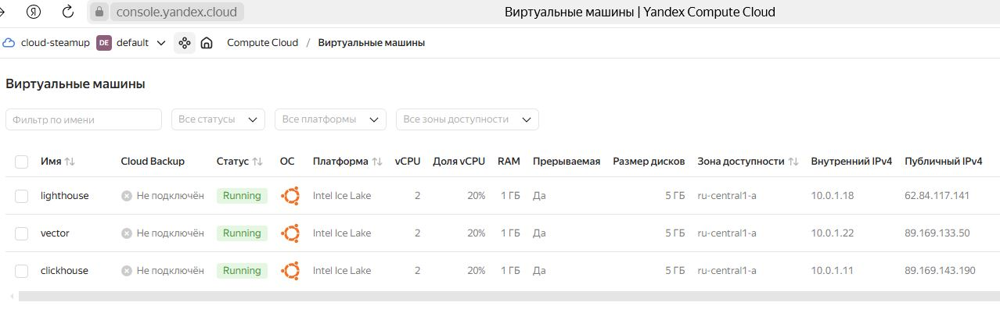

«Работа с roles» - «Бычков Денис Вячеславович»      
    
--- 

Создайте два пустых публичных репозитория в любом своём проекте: vector-role и lighthouse-role.

vector-role - https://github.com/dvbychkov/vector-role
lighthouse-role - https://github.com/dvbychkov/lighthouse-role

Основная часть

1. Создайте в старой версии playbook файл requirements.yml и заполните его содержимым:

2. При помощи ansible-galaxy скачайте себе эту роль.

3. Создайте новый каталог с ролью при помощи ansible-galaxy role init vector-role.

4. На основе tasks из старого playbook заполните новую role. Разнесите переменные между vars и default.

5. Перенести нужные шаблоны конфигов в templates.

6. Опишите в README.md обе роли и их параметры. Пример качественной документации ansible role по ссылке.

7. Повторите шаги 3–6 для LightHouse. Помните, что одна роль должна настраивать один продукт.

8. Выложите все roles в репозитории. Проставьте теги, используя семантическую нумерацию. Добавьте roles в requirements.yml в playbook.

9. Переработайте playbook на использование roles. Не забудьте про зависимости LightHouse и возможности совмещения roles с tasks.

10. Выложите playbook в репозиторий.

11. В ответе дайте ссылки на оба репозитория с roles и одну ссылку на репозиторий с playbook.

